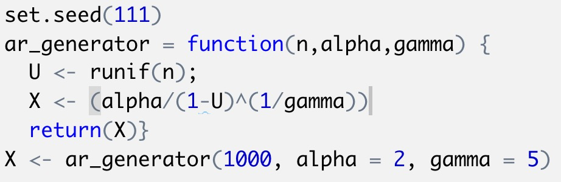
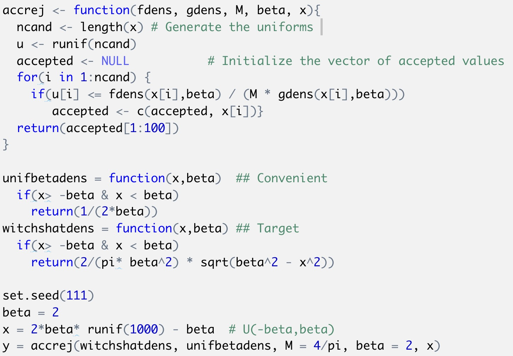

```{r setup, include=FALSE}
knitr::opts_chunk$set(echo = FALSE)
```

## Generate pseudorandom variable from the pdf

**1. Inverse transformation**

\[
\mathrm{P}(X \leq x)=\mathrm{P}\left(F^{-1}(U) \leq x\right)=\mathrm{P}(U \leq F(x))=F(x)
\]

So $F(x)$ is the cdf of $X$ and thus $f(x)$ is its density.


**Basic algorithm:**

Derive the inverse function $F^{-1}(\cdot)$ then

1. Generate a random number $u$ from $U(0,1)$ distribution

2. $\operatorname{Set} X=F^{-1}(U)$
Then $X$ will have the cdf $F(\cdot)$

## Example

$$
\begin{aligned}
\text{pdf:} \quad &f(x; \alpha, \gamma)=\frac{\gamma\alpha^{\gamma}}{x^{\gamma+1}} I\{x\ge \alpha\} \quad\alpha >0,\gamma>0. \\
&F(x) = \int_{-\infty}^{x}f(t)dt = \int_{\alpha}^{x}\frac{\gamma\alpha^{\gamma}}{t^{\gamma+1}}dt = 1- \alpha^{\gamma}x^{-\gamma}\\
&x = F^{-1}(u) =\frac{\alpha}{(1-u)^\frac{1}{\gamma}}
\end{aligned}
$$ 

```{r,warning= FALSE, message = FALSE,out.width='45%',fig.show='hold',fig.align='center'}


set.seed(111)
ar_generator = function(n,alpha,gamma) {
  U <- runif(n);
  X <- (alpha/(1-U)^(1/gamma))
  return(X)}
X <- ar_generator(1000, alpha = 2, gamma = 5)

alpha = 2; gamma = 5
hist(X,prob=TRUE,breaks = 20)
curve(gamma*alpha^gamma/{x^(gamma+1)},2,8,add = TRUE)
```

## Generate pseudorandom variable from the pdf
**2. Inverse transformation **

Target cdf $F(\cdot)$ or pdf $f(\cdot)\left(\text { no closed from of } F^{-1}\right)$
Alternative cdf $G(\cdot)$ or pdf $g(x)$ (one that's easy to sample from), satisfying
\[
\frac{f(x)}{g(x)} \leq M, \text { for all } x
\]

Choose $g(\cdot)$ and the value $M$

1. Generate $y$ from the distribution with pdf $g(\cdot)$

2. Generate $u$ from $U(0,1)$ distribution.

3. If $u \leq \frac{f(y)}{M g(y)}$ then set $x=y,$ if $u>\frac{f(y)}{M g(y)}$ then return to step 1. Then x has pdf $f(\cdot)$.

## Example
$$
\begin{split}
\text{pdf}: \quad&f(x) = \frac{2}{\pi \beta^2} \sqrt{\beta^2-x^2}, \,\, -\beta \le x \le \beta\\
&g(x) = \frac{1}{2\beta},\,\, -\beta \le x \le \beta \\
&M = sup(\frac{f(x)}{g(x)}) = \frac{4}{\pi}
\end{split}
$$
```{r,warning= FALSE, message = FALSE,out.width='45%',fig.show='hold',fig.align='center'}
 
accrej <- function(fdens, gdens, M, beta, x){
  ncand <- length(x) # Generate the uniforms 
  u <- runif(ncand)
  accepted <- NULL           # Initialize the vector of accepted values
  for(i in 1:ncand) {
    if(u[i] <= fdens(x[i],beta) / (M * gdens(x[i],beta)))
       accepted <- c(accepted, x[i])}
  return(accepted[1:100])
}

unifbetadens = function(x,beta)  ## Convenient 
  if(x> -beta & x < beta)
    return(1/(2*beta))
witchshatdens = function(x,beta) ## Target
  if(x> -beta & x < beta)
    return(2/(pi* beta^2) * sqrt(beta^2 - x^2))

set.seed(111)
beta = 2
x = 2*beta* runif(1000) - beta  # U(-beta,beta)
y = accrej(witchshatdens, unifbetadens, M = 4/pi, beta = 2, x)

hist(y,prob = TRUE, breaks = 15, xlim = c(-beta,beta))
curve(2/(pi* beta^2) * sqrt(beta^2 - x^2),-2,2,add = TRUE)
```


## Monte-Carlo Procedure
1. Generate $K$ independent data sets under a condition of interest;

2. Compute the estimator or test statistics for each simulated data; $S_{1}, \ldots, S_{K}$

3. With sufficiently large $K$, the empirical distribution of $S_{1}, \ldots, S_{K}$ is a good approximation to the true sampling distribution of the target estimator / test statistics under the conditions of interest. e.g.
\begin{itemize}
\setbeamertemplate{items}[ball]
\item Sample mean $\left(S_{1}, \ldots, S_{K}\right)-\theta_{0}$ is a good approximation of bias
\item $\operatorname{Var}\left(S_{1}, \ldots, S_{K}\right)$ is a good approximation of standard errors
\end{itemize}

## Mento Carlo Integration
\[
\int_{a}^{b} g(x) d x=\int_{a}^{b} \frac{g(x)}{p(x)} p(x) d x
\]
where $p(x)$ is a known probability density function on the support of $[a, b]$
\begin{itemize}
\setbeamertemplate{items}[ball]
\item $g(x)-$ nominal distribution
\item $p(x)-$ importance distribution (Common)
\end{itemize}
Then, generate $X_{1}, \cdots, X_{n} \sim p(x)$ and estimate the integral with
\[
\frac{1}{n} \sum_{i=1}^{n} \frac{g\left(X_{i}\right)}{p\left(X_{i}\right)}
\]

**Example:** 
$$
\theta=\int_0^1 e^{x^2} dx = \int_0^1 \frac{e^{x^2}}{1} *1 dx
$$
$g(x) = e^{x^2}$, $p(x)$ is U[0,1], $x_1,...,x_n \sim p(x)$. We just need to simulate random uniforms on [0,1] and compute $\frac{1}{n}\sum_{i=1}^{n} \frac{e^{x^2}}{1}$.


```{r echo = TRUE}
set.seed(111)
N = 10000
u = runif(N)
y = sum(exp(u^2))/N
```

