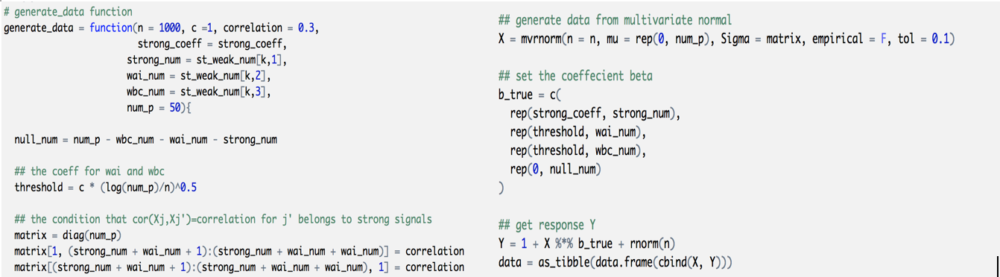

```{r setup, include=FALSE}
knitr::opts_chunk$set(echo = FALSE)
```

## Objective.

To effectively analyze different variable selection methods for high dimensional data, dataset that contains a combination of **strong**, **WAI**, **WBC**, and **Null** predictors had to be generated. The signals were created using the following criterias:

**1. Strong signals**
\[
S_{strong} = {j: |\beta_j| > c\sqrt{\frac{log(p)}{n}} \text{, for some c} > 0, 1 \leq j \leq p}
\]
**2. Weak-and-independent (WAI)**
\[
S_{WBC} = j: |\beta_j| \leq c\sqrt{\frac{log \, (p)}{n}}\text{, for some c > 0}, corr(X_j, X_j’) \neq 0
\]
**3. Weak-and-correlated (WBC)**
\[
S_{WBC} = j: |\beta_j| \leq c\sqrt{\frac{log \, (p)}{n}}\text{, for some c > 0}, corr(X_j, X_j’) = 0
\]
**4. Null signals**
\[
S_{null} = {j: \beta_j = 0, 1 \leq j \leq p}
\]

## The general idea of generating data

1. Create a 50x50 positive-definite variance-covariance matrix with WBC variables being correlated to the first strong predictor with $corr(X_j, X_j’) = 0.3$

2. Generate a multivariate normal distribution with mean 0 and sigma equal to the variance-covariance matrix generated in step one.

3. The matrix of true coefficient values was created with the strong signals set to 5 and the weak predictors (WAI and WBC) set to the threshold value defined by the changing c value.

4. Finally, get the linear response Y values:

$$Y=1+X\beta+\epsilon$$

```{r,warning= FALSE, message = FALSE,out.width='80%',fig.show='hold',fig.align='center'}

```
