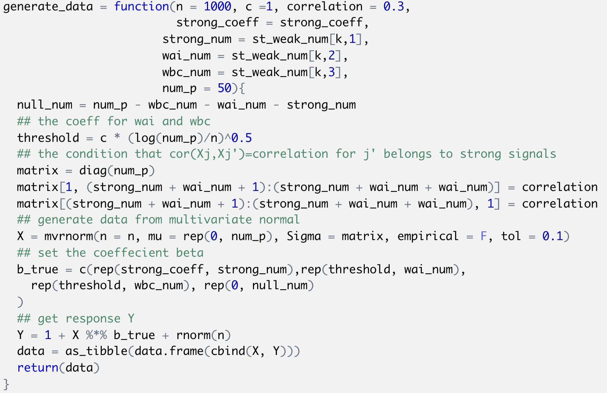

```{r setup, include=FALSE}
knitr::opts_chunk$set(echo = FALSE,warning = FALSE,message = FALSE)
library(tidyverse)
library(kableExtra)
set.seed(1)
```

# Simulation from Data Science

## Simulation: SLR for one n

In writing functions we wrote a short function to simulate data from a simple linear regression, fit the regression model, and return estimates of regression coefficients. Specifically, we generate data from $$y_i=0+\beta_1x_i+e_i$$

```{r, echo=TRUE}
sim_regression = function(n, beta0 = 2, beta1 = 3) {
  #generate simulation data
  sim_data = tibble(
    x = rnorm(n, mean = 1, sd = 1),
    y = beta0 + beta1 * x + rnorm(n, 0, 1)
  )
  # fit data with linear model
  ls_fit = lm(y ~ x, data = sim_data)
  tibble(
    beta0_hat = coef(ls_fit)[1],
    beta1_hat = coef(ls_fit)[2]
  )
}
```

## Rerun using for loop

```{r,echo= TRUE}
output = vector("list", 1000)
for (i in 1:1000) {
  output[[i]] = sim_regression(n = 30)
}
sim_results = bind_rows(output) 

# bind_rows: useful function to combine the rows
```

## Rerun using 'purrr'

Taking a look at the for loop we used to create these results, you might notice that there’s no input list – the sequence is used to keep track of the output but doesn’t affect the computation performed inside the for loop. In cases like these, the purrr::rerun function is very handy.
```{r echo= TRUE}
sim_results = 
  rerun(1000, sim_regression(30, 2, 3)) %>% 
  bind_rows()
```

Structurally, rerun is a lot like map – the first argument defines the amount of iteration and the second argument is the function to use in each iteration step. As with map, we’ve replaced a for loop with a segment of code that makes our purpose much more transparent but both approaches give the same results.

## Plot

Summaries for our simulation results
```{r,warning= FALSE, message = FALSE,out.width='45%',fig.show='hold',fig.align='center'}
# ensure beta0_hat follows normal distribution
sim_results %>% 
  ggplot(aes(x = beta0_hat)) + 
  geom_density()

```

```{r,warning= FALSE, message = FALSE,out.width='45%',fig.show='hold',fig.align='center'}
# plot the result
sim_results %>% 
  ggplot(aes(x = beta0_hat, y = beta1_hat)) + 
  geom_point()
```


## Simulation: SLR for several ns

To simulate with different sample sizes

```{r, echo= TRUE}
n_list = list("n_30"  = 30, 
              "n_60"  = 60, 
              "n_120" = 120, 
              "n_240" = 240)
output = vector("list", length = 4)

for (i in 1:4) {
  output[[i]] = rerun(100, sim_regression(n_list[[i]])) %>% 
    bind_rows
}
```
After this loop, output is a list of 4 data frames; each data frame contains the results of 100 simulations at different sample sizes.


## Using list columns and map

```{r, echo= TRUE}
simulate_n_regressions = 
  function(n_runs = 100, n, beta0 = 2, beta1 = 3) {
  rerun(n_runs, sim_regression(n, beta0, beta1)) %>% 
    bind_rows()
}
sim_results = 
  tibble(sample_size = c(30, 60, 120, 240)) %>% 
  mutate(estimate_dfs = 
    map(.x = sample_size, ~simulate_n_regressions(n = .x))) %>% 
  unnest
```

Using a different call to increase the number of simulation runs or vary the parameters in the regression model:

```{r, echo= TRUE}
sim_results = 
  tibble(sample_size = c(30, 60, 120, 240)) %>% 
  mutate(
  estimate_dfs = map(.x = sample_size, 
      ~simulate_n_regressions(n_runs = 1000, n = .x))
  ) %>% unnest
```

## Results

the distribution of slope estimates across sample sizes
```{r,warning= FALSE, message = FALSE,out.width='70%',fig.show='hold',fig.align='center'}
sim_results %>% 
  mutate(
    sample_size = str_c("n = ", sample_size),
    sample_size = fct_inorder(sample_size)) %>% 
  ggplot(aes(x = sample_size, y = beta1_hat, fill = sample_size)) + 
  geom_violin()
```
These estimates are centered around the truth (3) for each sample size, and the width of the distribution shrinks as sample size grows.

## Results
the bivariate distribution of intercept and slope estimates across sample sizes
```{r,warning= FALSE, message = FALSE,out.width='70%',fig.show='hold',fig.align='center'}
sim_results %>% 
  mutate(
    sample_size = str_c("n = ", sample_size),
    sample_size = fct_inorder(sample_size)) %>% 
  ggplot(aes(x = beta0_hat, y = beta1_hat)) + 
  geom_point(alpha = .2) + 
  facet_grid(~sample_size)
```
Estimates of the intercept and slope are correlated with each other; this is expected from theoretical results describing the joint distribution of estimated regression coefficients.

## Results

the empirical mean and variance of these estimates.
```{r}
sim_results %>% 
  gather(key = parameter, value = estimate, beta0_hat:beta1_hat) %>% 
  group_by(parameter, sample_size) %>% 
  summarize(emp_mean = mean(estimate),
            emp_var = var(estimate)) %>% 
  knitr::kable(digits = 3) %>% 
  kable_styling(
    latex_options = c("scale_down"))
  
```
These values are consistent with the formulas presented above. This kind of check is a useful way to support derivations (although they don’t serve as a formal proof in any way).


# Simulation from Statistical Computing

## Generate pseudorandom variable from the pdf

**1. Inverse transformation**

\[
\mathrm{P}(X \leq x)=\mathrm{P}\left(F^{-1}(U) \leq x\right)=\mathrm{P}(U \leq F(x))=F(x)
\]

So $F(x)$ is the cdf of $X$ and thus $f(x)$ is its density.


**Basic algorithm**:

Derive the inverse function $F^{-1}(\cdot)$ then

1. Generate a random number $u$ from $U(0,1)$ distribution

2. $\operatorname{Set} X=F^{-1}(U)$
Then $X$ will have the cdf $F(\cdot)$

## Example

$$
\begin{aligned}
\text{pdf:} \quad &f(x; \alpha, \gamma)=\frac{\gamma\alpha^{\gamma}}{x^{\gamma+1}} I\{x\ge \alpha\} \quad\alpha >0,\gamma>0. \\
&F(x) = \int_{-\infty}^{x}f(t)dt = \int_{\alpha}^{x}\frac{\gamma\alpha^{\gamma}}{t^{\gamma+1}}dt = 1- \alpha^{\gamma}x^{-\gamma}\\
&x = F^{-1}(u) =\frac{\alpha}{(1-u)^\frac{1}{\gamma}}
\end{aligned}
$$ 

```{r,warning= FALSE, message = FALSE,out.width='60%',fig.show='hold',fig.align='center'}
set.seed(111)
ar_generator = function(n,alpha,gamma) {
  U <- runif(n);
  X <- (alpha/(1-U)^(1/gamma))
  return(X)}
X <- ar_generator(1000, alpha = 2, gamma = 5)

alpha = 2; gamma = 5
hist(X,prob=TRUE,breaks = 20)
curve(gamma*alpha^gamma/{x^(gamma+1)},2,8,add = TRUE)
```

## Code
```{r,echo=T,eval=FALSE}
set.seed(111)
ar_generator = function(n,alpha,gamma) {
  U <- runif(n);
  X <- (alpha/(1-U)^(1/gamma))
  return(X)}

X <- ar_generator(1000, alpha = 2, gamma = 5)

alpha = 2; gamma = 5
hist(X,prob=TRUE,breaks = 20)
curve(gamma*alpha^gamma/{x^(gamma+1)},2,8,add = TRUE)

```

## Generate pseudorandom variable from the pdf

**2. Inverse transformation**

Target cdf $F(\cdot)$ or pdf $f(\cdot)\left(\text { no closed from of } F^{-1}\right)$
Alternative cdf $G(\cdot)$ or pdf $g(x)$ (one that's easy to sample from), satisfying
\[
\frac{f(x)}{g(x)} \leq M, \text { for all } x
\]

**Choose $g(\cdot)$ and the value $M$**

1. Generate $y$ from the distribution with pdf $g(\cdot)$

2. Generate $u$ from $U(0,1)$ distribution.

3. If $u \leq \frac{f(y)}{M g(y)}$ then set $x=y,$ if $u>\frac{f(y)}{M g(y)}$ then return to step 1. Then x has pdf $f(\cdot)$.

## Example
$$
\begin{split}
\text{pdf}: \quad&f(x) = \frac{2}{\pi \beta^2} \sqrt{\beta^2-x^2}, \,\, -\beta \le x \le \beta\\
&g(x) = \frac{1}{2\beta},\,\, -\beta \le x \le \beta \\
&M = sup(\frac{f(x)}{g(x)}) = \frac{4}{\pi}
\end{split}
$$
```{r,warning= FALSE, message = FALSE,out.width='60%',fig.show='hold',fig.align='center'}
accrej <- function(fdens, gdens, M, beta, x){
  ncand <- length(x) # Generate the uniforms 
  u <- runif(ncand)
  accepted <- NULL           # Initialize the vector of accepted values
  for(i in 1:ncand) {
    if(u[i] <= fdens(x[i],beta) / (M * gdens(x[i],beta)))
       accepted <- c(accepted, x[i])}
  return(accepted[1:100])
}

unifbetadens = function(x,beta)  ## Convenient 
  if(x> -beta & x < beta)
    return(1/(2*beta))
witchshatdens = function(x,beta) ## Target
  if(x> -beta & x < beta)
    return(2/(pi* beta^2) * sqrt(beta^2 - x^2))

set.seed(111)
beta = 2
x = 2*beta* runif(1000) - beta  # U(-beta,beta)
y = accrej(witchshatdens, unifbetadens, M = 4/pi, beta = 2, x)

hist(y,prob = TRUE, breaks = 15, xlim = c(-beta,beta))
curve(2/(pi* beta^2) * sqrt(beta^2 - x^2),-2,2,add = TRUE)
```

## Code
```{r echo= TRUE, eval = FALSE}
accrej <- function(fdens, gdens, M, beta, x){
  ncand <- length(x) # Generate the uniforms 
  u <- runif(ncand)
  accepted <- NULL 
  # Initialize the vector of accepted values
  for(i in 1:ncand) {
    if(u[i] <= fdens(x[i],beta) / (M * gdens(x[i],beta)))
       accepted <- c(accepted, x[i])}
  return(accepted[1:100])
}
unifbetadens = function(x,beta)  ## Convenient 
  if(x> -beta & x < beta)
    return(1/(2*beta))
witchshatdens = function(x,beta) ## Target
  if(x> -beta & x < beta)
    return(2/(pi* beta^2) * sqrt(beta^2 - x^2))
set.seed(111)
beta = 2
x = 2*beta* runif(1000) - beta  # U(-beta,beta)
y = accrej(witchshatdens, unifbetadens, M = 4/pi, beta = 2, x)
```


## Monte-Carlo Procedure
1. Generate $K$ independent data sets under a condition of interest;

2. Compute the estimator or test statistics for each simulated data; $S_{1}, \ldots, S_{K}$

3. With sufficiently large $K$, the empirical distribution of $S_{1}, \ldots, S_{K}$ is a good approximation to the true sampling distribution of the target estimator / test statistics under the conditions of interest. e.g.
\begin{itemize}
\setbeamertemplate{items}[ball]
\item Sample mean $\left(S_{1}, \ldots, S_{K}\right)-\theta_{0}$ is a good approximation of bias
\item $\operatorname{Var}\left(S_{1}, \ldots, S_{K}\right)$ is a good approximation of standard errors
\end{itemize}

## Mento Carlo Integration
\[
\int_{a}^{b} g(x) d x=\int_{a}^{b} \frac{g(x)}{p(x)} p(x) d x
\]
where $p(x)$ is a known probability density function on the support of $[a, b]$
\begin{itemize}
\setbeamertemplate{items}[ball]
\item $g(x)-$ nominal distribution
\item $p(x)-$ importance distribution (Common)
\end{itemize}
Then, generate $X_{1}, \cdots, X_{n} \sim p(x)$ and estimate the integral with
\[
\frac{1}{n} \sum_{i=1}^{n} \frac{g\left(X_{i}\right)}{p\left(X_{i}\right)}
\]

## Example
$$
\theta=\int_0^1 e^{x^2} dx = \int_0^1 \frac{e^{x^2}}{1} *1 dx
$$

Here $g(x) = e^{x^2}$, $p(x)$ is U[0,1], $x_1,...,x_n \sim p(x)$. 

We just need to simulate random uniforms on [0,1] and compute $\frac{1}{n}\sum_{i=1}^{n} \frac{e^{x^2}}{1}$.


```{r echo = TRUE}
set.seed(111)
N = 10000
u = runif(N)
y = sum(exp(u^2))/N
```


# Xinru's Project

## Objective

To effectively analyze different variable selection methods for high dimensional data, we have to generate a dataset containing a combination of **strong**, **WAI**, **WBC**, and **Null** predictors. The signals were created using the following criterias:

**1. Strong signals**
\[
S_{strong} = {j: |\beta_j| > c\sqrt{\frac{log(p)}{n}} \text{, for some c} > 0, 1 \leq j \leq p}
\]
**2. Weak-and-independent (WAI)**
\[
S_{WBC} = j: |\beta_j| \leq c\sqrt{\frac{log \, (p)}{n}}\text{, for some c > 0}, corr(X_j, X_j’) \neq 0
\]
**3. Weak-and-correlated (WBC)**
\[
S_{WBC} = j: |\beta_j| \leq c\sqrt{\frac{log \, (p)}{n}}\text{, for some c > 0}, corr(X_j, X_j’) = 0
\]
**4. Null signals**
\[
S_{null} = {j: \beta_j = 0, 1 \leq j \leq p}
\]

## The general idea of generating data

1. Create a 50x50 positive-definite variance-covariance matrix with WBC variables being correlated to the first strong predictor with $corr(X_j, X_j’) = 0.3$

2. Generate a multivariate normal distribution with mean 0 and sigma equal to the variance-covariance matrix generated in step one.

3. The matrix of true coefficient values was created with the strong signals set to 5 and the weak predictors (WAI and WBC) set to the threshold value defined by the changing c value.

4. Finally, get the linear response Y values:

$$Y=1+X\beta+\epsilon$$


## Code
```{r}
generate_data = function(n = 1000, c =1, correlation = 0.3,
                         strong_coeff = strong_coeff,
                       strong_num = st_weak_num[k,1],
                       wai_num = st_weak_num[k,2], 
                       wbc_num = st_weak_num[k,3],
                       num_p = 50){
  null_num = num_p - wbc_num - wai_num - strong_num
  ## the coeff for wai and wbc
  threshold = c * (log(num_p)/n)^0.5
  ## the condition that cor(Xj,Xj')=correlation for j' belongs to strong signals 
  matrix = diag(num_p)
  matrix[1, (strong_num + wai_num + 1):(strong_num + wai_num + wai_num)] = correlation
  matrix[(strong_num + wai_num + 1):(strong_num + wai_num + wai_num), 1] = correlation
  ## generate data from multivariate normal
  X = mvrnorm(n = n, mu = rep(0, num_p), Sigma = matrix, empirical = F, tol = 0.1)
  ## set the coeffecient beta
  b_true = c(rep(strong_coeff, strong_num),rep(threshold, wai_num), 
    rep(threshold, wbc_num), rep(0, null_num) 
  )
  ## get response Y
  Y = 1 + X %*% b_true + rnorm(n)
  data = as_tibble(data.frame(cbind(X, Y)))
  return(data)
}
```

```{r,warning= FALSE, message = FALSE,out.width='100%',fig.show='hold',fig.align='center'}

```
